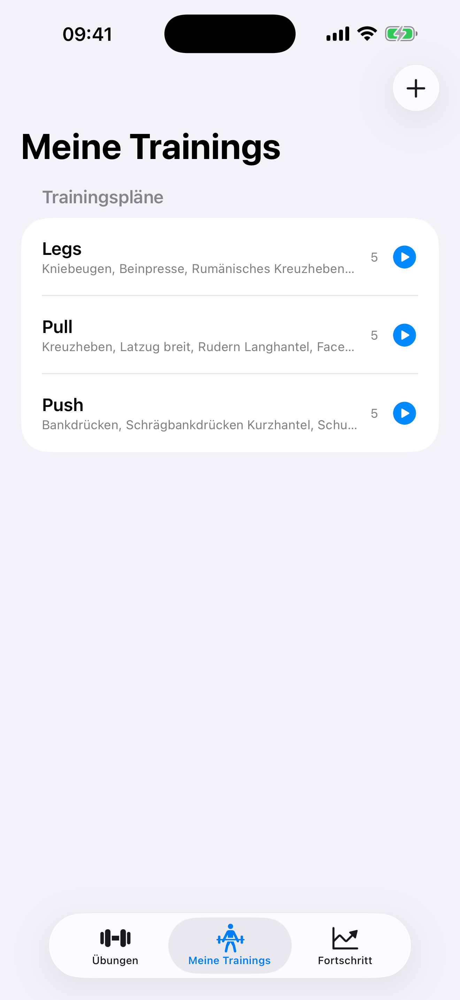
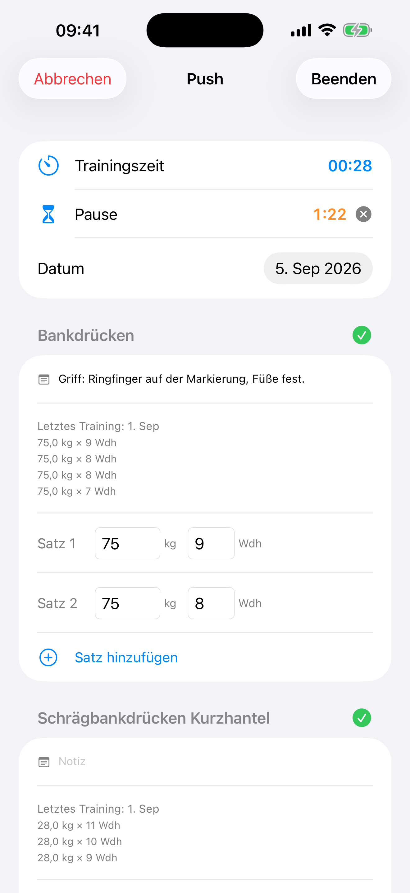
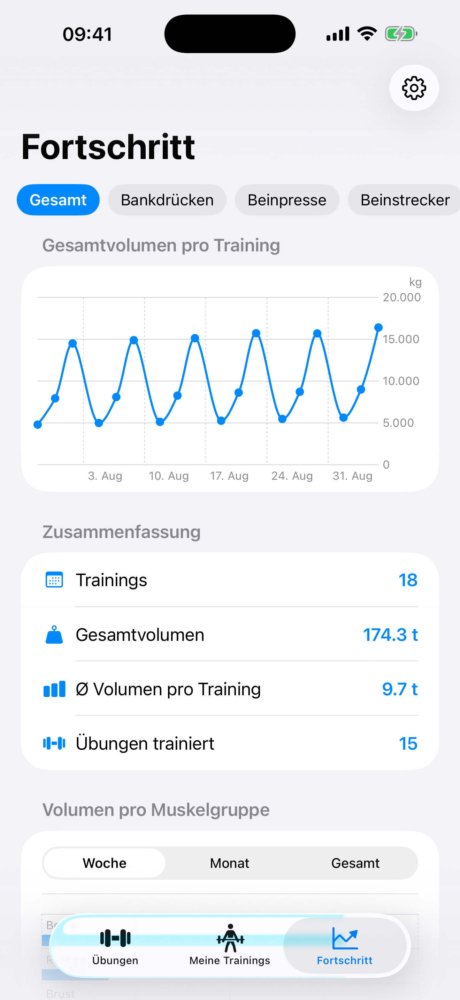
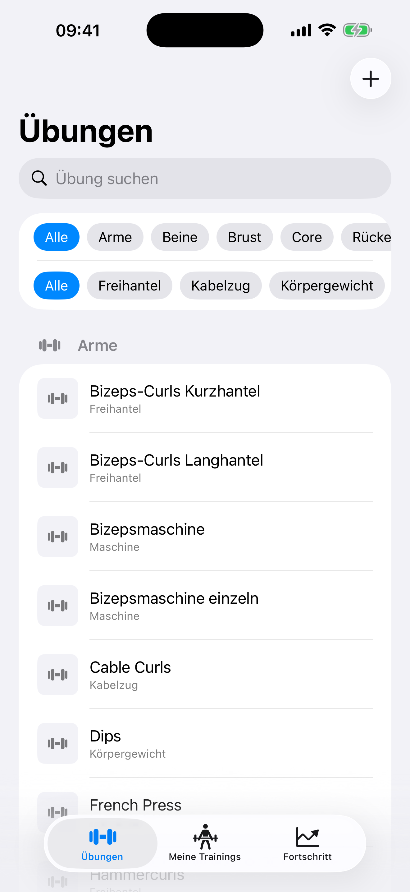
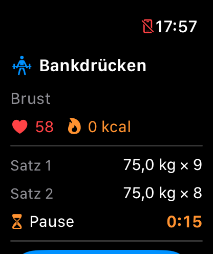

# TrackGym

Plan your strength training on the iPhone, log every set from the Apple Watch, and let the workout count in Apple Health — a native iOS + watchOS app built with SwiftUI, SwiftData, WatchConnectivity and HealthKit.

[](https://github.com/mehling23/TrackGym/actions/workflows/build.yml)


<p align="center">
  
  
  
  
</p>
<p align="center">
  
</p>

## What it does

**iPhone — plan, track, review**

- **Training plans** from a catalogue of 77 exercises (German names) grouped by muscle group and equipment, plus your own custom exercises. Drag to set the order the exercises come up in.
- **Live tracking**: start a plan, see last session's sets next to each exercise, pre-filled sets you only adjust, per-exercise notes ("safety pins on 14"), a training clock and a **rest timer** after every logged set.
- **Progress**: weight and volume charts per exercise, personal-record badges, and volume per muscle group for the last week, month or year.
- **Backup**: export and import everything as JSON. Exercises carry stable UUIDs, so a backup restored on a new phone keeps every plan and history link intact.

**Apple Watch — log without touching the phone**

- Shows the current exercise and its sets; log the next set with the Digital Crown. Sets reach the phone instantly, or are queued and delivered later if the phone is out of reach.
- Runs an **HKWorkoutSession** while the workout is active: live heart rate and active calories on the watch face, and the finished strength workout is saved to Apple Health and counts toward the activity rings.
- Rest timer mirrored from the phone with a wrist tap when the pause is over.

The watch is deliberately a logging surface only. Plan setup, history and settings live on the iPhone.

## Architecture

```
TrackGym/                          # iOS app
├── Models/                        # SwiftData @Model types
├── Data/                          # Seeding, JSON backup, WCSession (phone side), statistics
└── Views/                         # SwiftUI screens
TrackGym Watch App Watch App/      # watchOS app — session UI, WCSession (watch side), HealthKit
TrackGymTests/, …AppTests/         # XCTest, in-memory SwiftData
```

- **SwiftUI + SwiftData** on the iPhone. Relationships declare explicit inverses and delete rules; plan exercise order is stored separately because SwiftData to-many relationships are unordered sets.
- **Swift 6 language mode** with main-actor default isolation. Delegate callbacks from WatchConnectivity and HealthKit are `nonisolated` and hop to the main actor with `Sendable` values only — the build is warning-free.
- **WatchConnectivity protocol**: the phone pushes the active exercise via `updateApplicationContext` (survives unreachability, replayed on watch launch) plus a low-latency `sendMessage`. Sets from the watch use an acknowledged `sendMessage` with a `transferUserInfo` fallback; the phone deduplicates by message id with a buffer that survives relaunches, and the watch refuses to replay a context older than four hours.
- **HealthKit on the watch**: `HKWorkoutSession` + `HKLiveWorkoutBuilder`, ended in Apple's documented order, with recovery of a session HealthKit kept alive after a crash. Denied permission degrades gracefully — tracking keeps working, only pulse/calories/rings are missing.
- **Data integrity**: import replaces the store atomically (validated first, rolled back on failure), pre-filled sets the user never touched are discarded rather than written to history, and entries left behind by an interrupted workout are cleaned up at launch.
- **Charts** framework for the progress views.

## Tests & CI

80 unit tests (66 iOS, 14 watchOS) plus a UI smoke test, all against in-memory SwiftData containers; GitHub Actions builds and tests both platforms on every push. Covered: backup round-trips (ids, order, notes, units, legacy files), duplicate detection, seeding, history lookups, statistics, watch payload parsing, dedup buffer, and the context-replay decision.

```bash
DEST=$(xcrun simctl list devices available \
  | sed -nE 's/.*iPhone.*\(([0-9A-F-]{36})\) \(Shutdown\).*/\1/p' | head -1)

xcodebuild test -project TrackGym.xcodeproj -scheme TrackGym -destination "id=$DEST"

WATCH=$(xcrun simctl list devices available \
  | sed -nE 's/.*Apple Watch.*\(([0-9A-F-]{36})\) \(Shutdown\).*/\1/p' | head -1)

xcodebuild test -project TrackGym.xcodeproj -scheme 'TrackGym Watch App Watch App' -destination "id=$WATCH"
```

## Build

Requires Xcode 26 (Swift 6 toolchain). Deployment targets: iOS 18.0, watchOS 10.0.

```bash
git clone https://github.com/mehling23/TrackGym.git
cd TrackGym
open TrackGym.xcodeproj
```

Run the **TrackGym** scheme on an iPhone (the watch app is embedded and installs on the paired watch) or **TrackGym Watch App Watch App** on a watch directly. A paired iPhone + Apple Watch simulator pair works for the full flow; heart rate on the simulator is synthetic.

To reproduce the screenshots, launch a Debug build with a demo backup:

```bash
xcrun simctl launch <iphone-udid> de.ehling.TrackGym -demoDataPath "$PWD/docs/demo-data.json"
```

## Roadmap

- English localization (UI is German-only today)
- Pause / resume of the HealthKit session
- iCloud sync

## License

[MIT](LICENSE) © 2026 Maximilian Ehling
